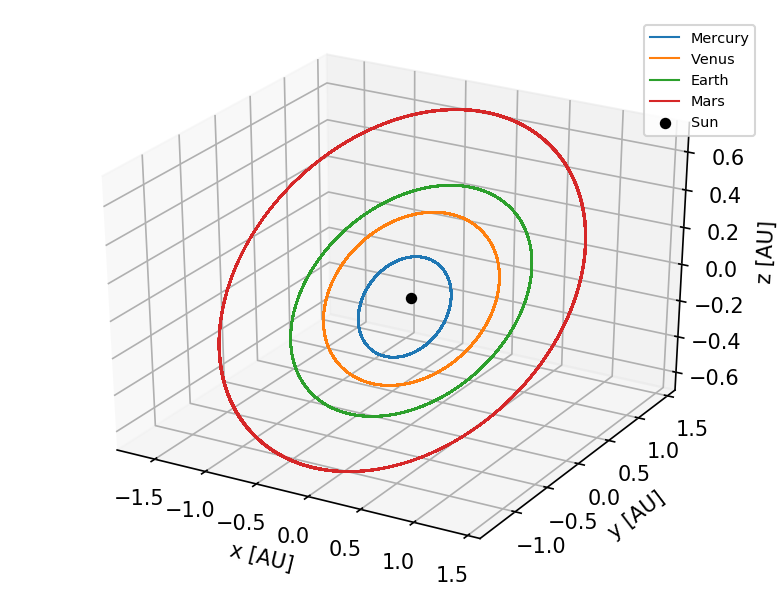
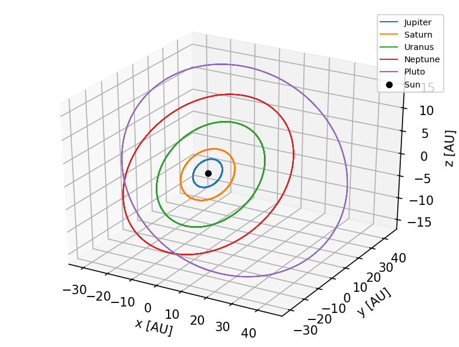

# RK4 Integrator
Implementation of a Runge-Kutta 4 integrator for planetary orbits using only numpy. 

The code takes a state vector and derives it for the integrator. There are two versions: an easy one, which utilizes for-loops, and a more complex one, which uses fancy indexing and masking for improved efficiency. 

## Results

### Inner Solar System 3D

 

 

### Outer Solar System 3D

 

 
